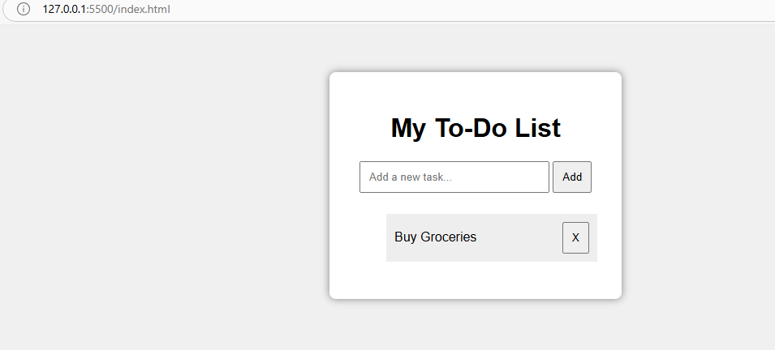

#  To-Do List Web App:-

A simple and responsive To-Do List web application built using HTML, CSS, and JavaScript.  
This project was created as part of a web development internship task.

---

# Features:-

-  Add new tasks
-  Mark tasks as completed (click to toggle)
-  Delete tasks using "X" button
-  Instant UI updates without page reload

---

# Screenshots:-

 Adding Tasks:-
[Adding Tasks](Adding items.png)

 Marking as Completed:-
[Mark as Completed](initial view.png)

 Deleting Tasks:-

---

# Tech Stack:-

- HTML5
- CSS3
- JavaScript (Vanilla)

---

# Folder Structure:-

todo-app/
├── index.html
├── style.css
├── script.js
├── README.md
├── adding-items.png
├── initial-view.png
└── delete.png

---
# Learning Outcome:-

- DOM manipulation in JavaScript
- Event handling and listeners
- Updating UI dynamically using JS
- Basic front-end development workflow

---
# Author:-

Nandhini D  TASK 2 COMPLETED
[GitHub Profile](https://github.com/nandhinidamodaran/todo-list-app.git)
